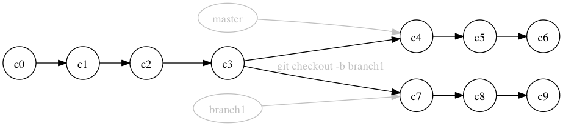

Graphviz 入门
===

把如下代码保存为hello.dot

```
digraph G {
	Hello -> World
}
```
输入命令：  
dot -T png hello.dot -o hello.png  
即可画出如下图片:  


###例子1

```
graph graphname {
	a -- b -- c;
	b -- d
}
```


###例子2
```
digraph graphname {
	a -> b -> c;
	b -> d;
}
```


###例子3
```
//DOT语言中，可以对节点和边添加不同的属性。

digraph graphname {
    //节点的属性，节点的名称
    a [lable = "Foo"];

    //节点的属性，节点的形状
    b [shape = box];

    //边的属性，边的颜色
    a -> b -> c [color = blue];

    //边的属性，边的线状
    b -> d [style = dotted];
}
```


###例子4
```
digraph G {
	//把图片的尺寸设为4inch * 4inch
	size = "4,4";
	main [shape = box];
	
	//边的重要程度，默认是1
	main->parse [weight = 8];
	parse->execute;
	
	//点状线
	main->init[style = dotted];
	main->cleanup;
	
	//连接了两条线
	execute->{make_string;printf}
	init->make_string;
	
	//把边的默认颜色设为red
	edge [color = red];
	main->printf [sytle=bold, label = "100times"];
	
	//节点的名称
	make_string [label = "make a\nstring"];
	
	//设置节点的默认属性
	node [shape=box,style =filled,color=lightgrey];
	execute->compare;
}
```


###例子5
```
digraph G{
	a -> b -> c;
	b -> d;
	
	/* 形状为多边形，边数为5，外框为3条，颜色为淡蓝，样式为填充 */
	a [shape = polygon, sides = 5, peripheries = 3, color = lightblue, style = filled];
	
	/* 形状为多边形，边数为4，角的倾斜度为0.4，内容为hellow world*/
	c [shape = polygon, sides = 4, skew = 0.4, label = "hello world"];
	
	/* 形状为倒三角，整体旋转30度 */
	d [shape = invtriangle,orientation = 30];
	
	/* 形状为多边形，边数为4，扭曲度为0.7 */
	e [shape = polygon, sides = 4, distortion = 0.7];
}

```


###例子6
```
digraph G {
	label = "Binary search tree";
	node [shape = record];

	A [label = "<f0>|<f1>A|<f2>"];
	B [label = "<f0>|<f1>B|<f2>"];
	C [label = "<f0>|<f1>C|<f2>"];
	D [label = "<f0>|<f1>D|<f2>"];
	E [label = "<f0>|<f1>E|<f2>"];
	F [label = "<f0>|<f1>F|<f2>"];
	G [label = "<f0>|<f1>G|<f2>"];

	A:f0 -> B:f1;
	A:f2 -> C:f1;
	B:f0 -> D:f1;
	B:f2 -> E:f1;
	C:f0 -> F:f1;
	C:f2 -> G:f1;
}
```


###例子7
```
digraph G{
	nodesep = .05;
	rankdir = LR;
	
	node [shape = record,width = .1,height = .1];
	node0 [label = "<f0>|<f1>|<f2>|<f3>|<f4>|<f5>|<f6>|",height = 2.5];
	
	node [width = 1.5];
	node1 [label = "{<n>n14|719|<p>}"];
	node2 [label = "{<n>a1|805|<p>}"];
	node3 [label = "{<n>i9|718|<p>}"];
	node4 [label = "{<n>e5|989|<p>}"];
	node5 [label = "{<n>t20|959|<p>}"];
	node6 [label = "{<n>o15|794|<p>}"];
	node7 [label = "{<n>s19|659|<p>}"];
	
	node0:f0 -> node1:n;
	node0:f1 -> node2:n;
	node0:f2 -> node3:n;
	node0:f5 -> node4:n;
	node0:f6 -> node5:n;
	node2:p -> node6:n;
	node4:p -> node7:n;
}
```


###例子8
```
digraph G {
    rankdir = LR;
    node [shape = "ellipse", fontcolor="gray", color = "gray"] master branch1;
    node [shape = "circle", fontcolor="black", color = "black"];

    c0 -> c1 -> c2 -> c3 -> c4 -> c5 -> c6;
    c3 -> c7 [label = "git checkout -b branch1", fontcolor = "gray"];
    c7 -> c8 -> c9;

    master -> c4 [color = "gray"];
    branch1 -> c7 [color = "gray"];
}
```


###例子9
```
digraph G {
	label = "Merge Sort";
    node [shape = box, style=rounded]
   
    node0 [label="4  2  5  3"];
    node1 [label="4  2"];
    node2 [label="5  3"];
    node3 [label="4"];
    node4 [label="2"];
    node5 [label="5"];
    node6 [label="3"];
    node0 -> node1;  node0 -> node2;
    node1 -> node3;  node1 -> node4;
    node2 -> node5;  node2 -> node6;

    node7 [label="2  4"];
    node8 [label="3  5"];
    node9 [label="2  3  4  5"];
    node3 -> node7; node4 -> node7;
    node5 -> node8; node6 -> node8;
    node7 -> node9; node8 -> node9;
}
```


###例子10
```
digraph G {   
    node[shape=record]   

    {rank=same;Context;Strategy}

    Context[label="{Context| +strategy : Strategy\l| +contextInterface()\l}"]
    docs [ style="filled", color="gold", label="Strategy AlgorithmInterface()"]
    edge [ arrowhead="none", style="dashed"]

    Context->docs
    Strategy[ label="{Strategy|\l|+algorithmInterface()\l}"]   
    ca[label="{ConcreteStrategyA|\l+algorithmInterface()\l}"]   
    cb[label="{ConcreteStrategyB|\l+algorithmInterface()\l}"]   
    cc[label="{ConcreteStrategyC|\l+algorithmInterface()\l}"]   

    edge[ arrowhead="odiamond", style="filled"]
    Strategy -> Context 
    edge[ arrowhead="onormal", style="filled"]
    {rank=same;ca;cb;cc;docs}
    ca->Strategy  
    cb->Strategy 
    cc->Strategy
}

```
